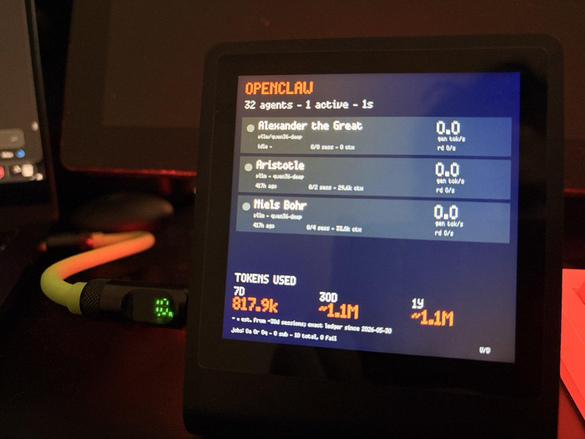
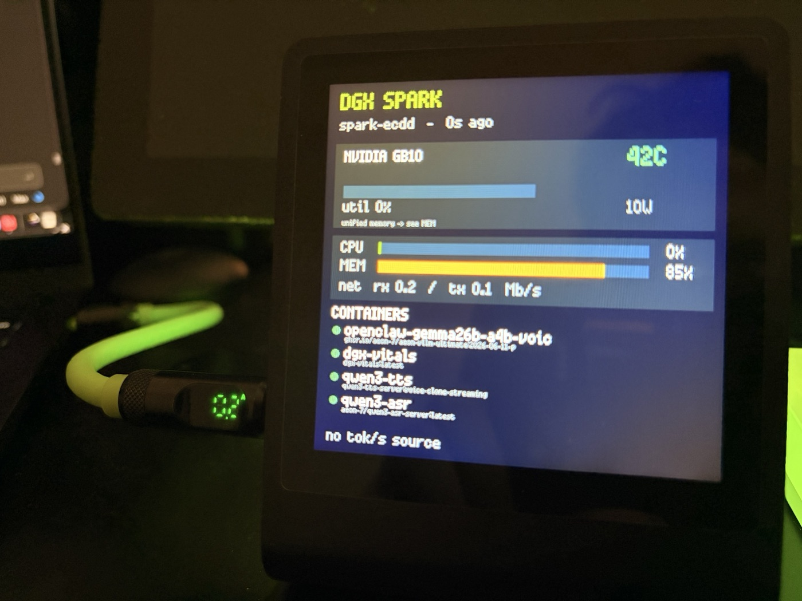
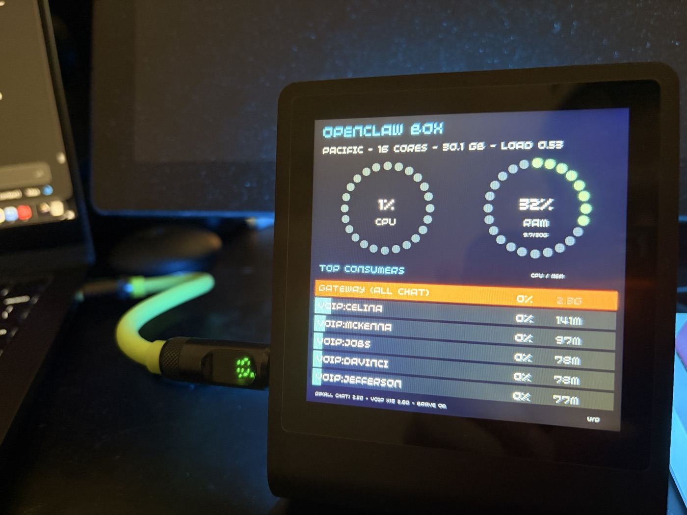
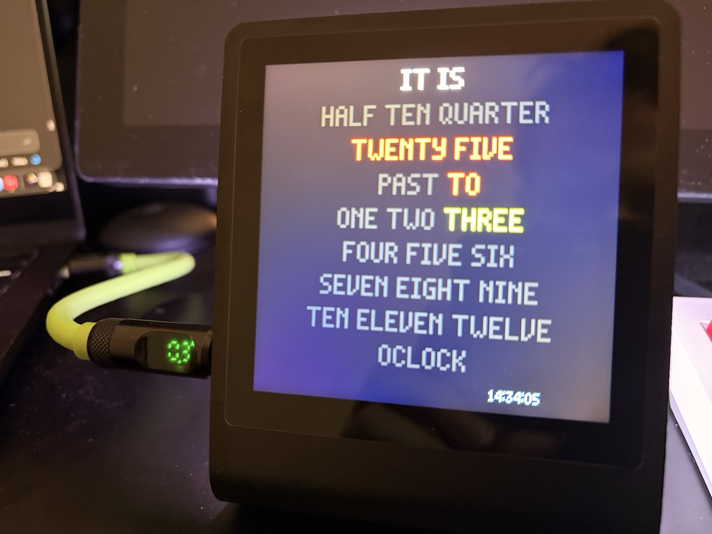

# Presto Cockpit

*A physical, glanceable dashboard for a home AI/GPU lab — on a tiny touchscreen you
can set on your desk.*

[](#-support-the-work)
[](LICENSE)

Presto Cockpit turns a **Pimoroni Presto** (a 480×480 touchscreen running MicroPython)
into a live wall of dials for the things a home lab actually cares about: your **GPU
box's vitals**, your **AI agents**, the **gateway host's load**, **crypto** prices, the
**room's** temperature and pressure, a word‑clock, and trending **AI news** — plus a
ring of rear RGB LEDs that glow the accent color of whatever screen you're on.

It's two small **backends** feeding one little **screen**:

```
   ┌──────────────────────────┐         ┌──────────────────────────────┐
   │  GPU / DGX box           │         │  OpenClaw gateway box        │
   │  dgx-vitals  :9876       │         │  openclaw-shim  :9787        │
   │  (GPU/CPU/mem/containers │         │  (per-agent tok/s, sessions, │
   │   + vLLM/ASR tok/s)      │         │   on-call, host load)        │
   └────────────┬─────────────┘         └───────────────┬──────────────┘
                │  HTTP /vitals                          │  HTTP /agents
                └──────────────────┬─────────────────────┘
                                   ▼   (WiFi, polled every 1–2 s)
                        ┌─────────────────────────┐
                        │   Pimoroni Presto       │  480×480 touch · RP2350
                        │   9 swipeable screens   │  + 7 rear RGB LEDs
                        │   + sensor stick        │  + Qw/ST nav pad
                        └─────────────────────────┘
```

Both backends are optional and independent — run one, both, or neither. Crypto,
environment, clock, and news screens work with no backend at all.

---

## Gallery

A few of the nine screens running on the actual hardware:

<table>
  <tr>
    <td width="50%" align="center"><br/><sub><b>OpenClaw</b> — every agent's live gen tok/s, sessions, context, and idle/active state, plus a 7d/30d/1y token‑usage ledger. Tap a row for session detail.</sub></td>
    <td width="50%" align="center"><br/><sub><b>DGX</b> — GPU temp/util/power, CPU + RAM bars, network, the running containers, and per‑model tok/s. Fed by the <code>dgx-vitals</code> sidecar.</sub></td>
  </tr>
  <tr>
    <td width="50%" align="center"><br/><sub><b>Resources</b> — the gateway host's CPU + RAM donut gauges and a ranked list of the top process consumers.</sub></td>
    <td width="50%" align="center"><br/><sub><b>Clock</b> — a QlockTwo‑style word grid that lights up the words for the current time.</sub></td>
  </tr>
</table>

---

## Build list

Everything connects over the Presto's **Qw/ST (Qwiic / STEMMA QT) I²C** bus — no
soldering, just plug‑in cables. Prices are approximate; check the vendor.

### Required — the cockpit itself
| Part | What it's for | Notes |
|---|---|---|
| **[Pimoroni Presto](https://shop.pimoroni.com/products/presto)** | the whole dashboard runs here | 4″ 480×480 capacitive touch, RP2350B, 7‑zone RGB backlight, 2.4 GHz WiFi (RM2/CYW43439), microSD, piezo, USB‑C; ships pre‑flashed with MicroPython. **~£60** standalone (or **~£90** Starter Kit with stand + cables). |
| **USB‑C cable** | flashing + power | any data‑capable USB‑C cable |

That alone runs the no‑backend screens (Clock, Crypto, News).

### Recommended — sensors + physical nav
| Part | Adds | Notes |
|---|---|---|
| **[Multi‑Sensor Stick](https://shop.pimoroni.com/products/multi-sensor-stick)** (PIM745) | the **Environment** screen + LED auto‑dim | BME280 (temp/humidity/pressure, `0x76`) + LTR559 (light, `0x23`) + LSM6DS3 (IMU). Qw/ST at both ends. **~£12** |
| **[Qw/ST Pad](https://shop.pimoroni.com/products/qwst-pad)** | physical **L/R** screen flipping | 8‑button I²C gamepad (touch works without it). Address‑configurable; this build expects **`0x21`**. **~£10** |
| **Qw/ST cable(s)** | daisy‑chain the above | Qwiic / STEMMA‑QT cables; the stick has a connector at each end, so chain Presto → stick → pad |

> The Presto **Starter Kit** bundles the stand + cables and is the simplest single purchase.

### Backends — tested hosts, but adaptable
The two backend services were **developed and tested on the hardware below — but the
Pimoroni Presto is the only hard requirement.** Swap in your own GPU box, inference
server, or agent stack as long as it can expose the same kind of metrics.

| Backend | Tested on | Feeds | Adapt it to… |
|---|---|---|---|
| `dgx-vitals` | an **NVIDIA DGX Spark** (GB10) | the **DGX** screen | **any Linux + Docker host.** It always reports CPU / RAM / network + running containers; GPU fields populate whenever NVML is present (any NVIDIA card), and per‑model **tok/s** comes from any vLLM‑style Prometheus `/metrics` endpoint you point it at (`VLLM_METRICS_URLS`). No GPU? It still serves everything else. |
| `openclaw-shim` | an **[OpenClaw](https://github.com/openclaw/openclaw) gateway** | the **OpenClaw** + **Resources** screens | **any agent stack — or none.** The screens only consume the shim's `/agents` JSON shape, so you can point them at any service that emits the same shape, or adapt `shim.py`'s "shell a CLI → digest → serve JSON" pattern to your own framework. |

---

## The screens

Swipe (touch) or press **L/R** on the pad to move between them. Default rotation:

| Screen | What it shows |
|---|---|
| **DGX** | Your GPU box: GPU name/temp/util/power, CPU load, RAM, a list of running containers, and live **tok/s + prompt‑prefill tok/s** per model. Fed by `dgx-vitals`. |
| **OpenClaw** | Every AI agent on your OpenClaw gateway: live **gen tok/s**, ingest rate, sessions, context size, "working"/"on‑call" state, and a 7d/30d/1y **token‑usage** ledger. Tap an agent for a session detail view. Fed by `openclaw-shim`. |
| **Resources** | The gateway host itself: CPU + RAM **donut gauges** and a ranked list of the top process consumers (chat gateway, per‑agent voice sidecars, browser, …). Fed by `openclaw-shim`. |
| **Kuma** | Live [Uptime Kuma](https://github.com/louislam/uptime-kuma) status — each monitor's up/down dot, response time, an `N/M up` / `X DOWN` header (down‑first), and an on‑device reliability %. Scrapes Kuma's Prometheus `/metrics` with an API key. |
| **News** | Trending AI/tech headlines (Hacker News front page, filtered). No backend or key needed. |
| **Crypto** | Live prices for a configurable basket (default BTC / ETH / XMR / SOL) via the free CoinGecko API. |
| **Environment** | Room temperature, humidity, and barometric pressure from the BME280, plus ambient light (lux). |
| **Clock** | A full‑screen **QlockTwo‑style word grid** that spells out the time, synced over NTP. |
| **Settings** | Live status of every feed, plus a **brightness** control (`+`/`−`, applied to both the panel backlight and the rear LEDs) and an **auto‑dim** toggle. Brightness defaults to a fixed 100% and persists to `secrets.json`. |

Also in the tree but **not in the default rotation** (kept for reference / re‑enable in
`app/app.py`'s `SCREENS_ORDER`): an **altitude / artificial‑horizon** screen (pressure +
IMU) and a **lights** screen (LED animations + image color‑sampling). They were dropped
from the live rotation for refresh speed.

### Rear LEDs
The 7 rear RGB LEDs glow the **accent color of the current screen**, and (optionally)
**auto‑dim** from the ambient‑light sensor so the cockpit isn't blinding in a dark room.

---

## The backends

### `dgx-vitals/` — GPU box telemetry (Docker)
A tiny FastAPI service you run **on the GPU machine**. One `GET /vitals` returns a JSON
snapshot: GPU (via NVML), CPU/RAM/net (via `psutil`), the running Docker containers, and
per‑model **tok/s** scraped from vLLM/ASR Prometheus endpoints. Runs with
`--network host --pid=host --gpus all` so it sees the real host. See
[`dgx-vitals/`](dgx-vitals/) and [`AGENTS.md`](AGENTS.md).

### `openclaw-shim/` — agent + host stats (systemd)
A stdlib‑only Python service you run **on the OpenClaw gateway box** (only relevant if
you run [OpenClaw](https://github.com/openclaw/openclaw)). The gateway speaks RPC/WS, so
the shim shells out to the `openclaw` CLI, digests the output, scans `/proc`, and serves
a clean `GET /agents` JSON for the OpenClaw + Resources screens. It's hardened against a
CLI‑subprocess leak and reports stale‑but‑present data rather than going blank on a
hiccup. See [`openclaw-shim/`](openclaw-shim/).

---

## Repo layout

```
presto-cockpit/
├── app/                  the MicroPython cockpit that runs ON the Presto
│   ├── app.py            screen router, input dispatch, poll loop
│   ├── screens/          one file per screen
│   ├── net/              tiny HTTP clients (dgx, openclaw, crypto, news)
│   ├── hw/               drivers: sensor stick, Qw/ST pad, rear LEDs
│   ├── lights/           LED animations + image color-sampling
│   ├── state.py theme.py shared state + colors
├── boot.py main.py       device entry points
├── deploy.sh             gen-secrets + push all files to the Presto via mpremote
├── gen-secrets.sh        .env  ->  secrets.json (UTF-8 safe)
├── dgx-vitals/           the GPU-box telemetry sidecar (Docker)
├── openclaw-shim/        the OpenClaw agent/host stats service (systemd)
├── tools/boottest.py     on-device self-test
├── .env.example          copy to .env and fill in
└── AGENTS.md             full step-by-step setup (for an AI agent or a human)
```

## Quickstart

```bash
cp .env.example .env      # fill in WiFi + your GPU_HOST / GATEWAY_HOST
./deploy.sh               # generates secrets.json and flashes the Presto over USB-C
# (then stand up the backends you want — see AGENTS.md)
```

**Full setup — including the two backends and each environment's architecture — is in
[`AGENTS.md`](AGENTS.md).** It's written so an AI agent can do the whole deployment, but
it reads fine for a human too.

## Configuration

Everything is driven by `.env` (→ `secrets.json` on the device). Hosts, poll intervals,
the crypto basket, LED brightness, and sea‑level pressure are all there. No secret ever
lives in the code — see [`.env.example`](.env.example). `.env` and `secrets.json` are
git‑ignored; keep them that way.

## ☕ Support the work

If this dashboard was useful — or you just like blinkenlights on your desk — tips are
deeply appreciated and go straight toward more compute, more hardware, and more open
releases. **Scan a QR with your wallet, or click any address below to copy.**

<table align="center">
  <tr>
    <td align="center" width="50%">
      <strong>₿ Bitcoin (BTC)</strong><br/>
      <br/>
      <sub><code>bc1q09xmzn00q4z3c5raene0f3pzn9d9pvawfm0py4</code></sub>
    </td>
    <td align="center" width="50%">
      <strong>Ξ Ethereum (ETH)</strong><br/>
      <br/>
      <sub><code>0x1512667F6D61454ad531d2E45C0a5d1fd82D0500</code></sub>
    </td>
  </tr>
  <tr>
    <td align="center" width="50%">
      <strong>◎ Solana (SOL)</strong><br/>
      <br/>
      <sub><code>DgQsjHdAnT5PNLQTNpJdpLS3tYGpVcsHQCkpoiAKsw8t</code></sub>
    </td>
    <td align="center" width="50%">
      <strong>ⓜ Monero (XMR)</strong><br/>
      <br/>
      <sub><code>836XrSKw4R76vNi3QPJ5Fa9ugcyvE2cWmKSPv3AhpTNNKvqP8v5ba9JRL4Vh7UnFNjDz3E2GXZDVVenu3rkZaNdUFhjAvgd</code></sub>
    </td>
  </tr>
</table>

> **Ethereum L2s (Base, Arbitrum, Optimism, Polygon, etc.) and EVM‑compatible tokens**
> can be sent to the same Ethereum address.

---

## License

MIT — see [`LICENSE`](LICENSE). The libraries it builds on (MicroPython, Pimoroni's
Presto modules, FastAPI, psutil) carry their own licenses.
